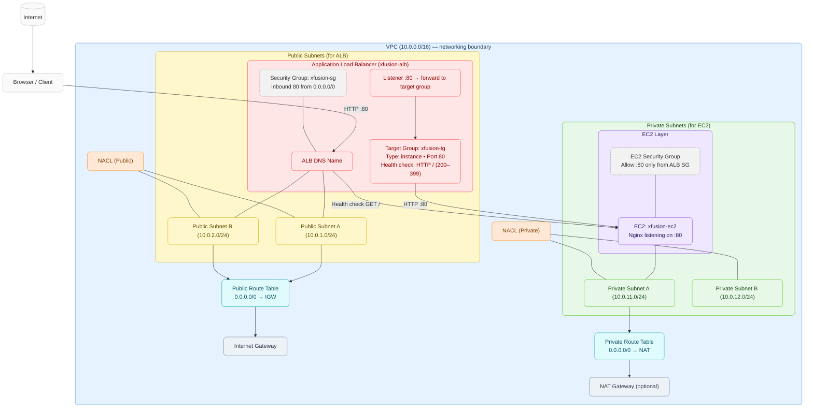
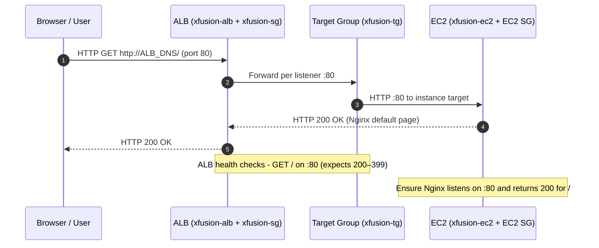

# AWS ALB → EC2 (Nginx) in VPC — Architecture & Why
**Topic:** Application Load Balancer (ALB) in front of EC2 (Nginx)  \
**Scope:** VPC, Subnets, ALB, Target Group, Security Groups, Route Tables, NACLs, IGW/NAT  \

---

## 1) Colored Mermaid Diagram — Fully Nested & Correct Placement

> ALB lives **inside public subnets**; EC2 lives **inside private subnets**; everything lives **inside the VPC**. Security Groups attach to ENIs of the ALB and EC2.



---

## 2) Sequence Diagram — Request Path & Health Checks (Parser-Safe)



---

## 3) Why Each Component (Interview-Ready)

### VPC
- **Why?** Logical network boundary containing subnets, route tables, SGs, NACLs, ALB, EC2.
- **Key rule:** ALB, TG, and EC2 must be in the **same VPC** to route traffic correctly.

### Subnets
- **Public (ALB)**: Needed for internet-facing ALB; public route table must send `0.0.0.0/0 → IGW`.
- **Private (EC2)**: Keeps servers off the public internet; only ALB reaches EC2 on port 80.
- **Multi-AZ:** ALB requires **2+ subnets in different AZs** for availability.

### Internet Gateway (IGW)
- **Why?** Provides internet connectivity for public subnets so the ALB can receive traffic.

### NAT Gateway (optional)
- **Why?** Allows private EC2 instances to make **outbound** internet calls (updates, package installs) without being publicly reachable.

### Route Tables
- **Public RT:** `0.0.0.0/0 → IGW` for ALB in public subnets.
- **Private RT:** `0.0.0.0/0 → NAT` (optional) for EC2 outbound.

### NACLs (stateless, subnet firewalls)
- Ensure inbound 80 + outbound ephemeral on public subnets for ALB; similarly permit flows on private subnets.

### Security Groups (stateful)
- **ALB SG (`xfusion-sg`)**: Inbound **80** from `0.0.0.0/0`; outbound allow all.
- **EC2 SG**: Inbound **80** **from source = ALB SG**; outbound allow all.
- **Why source SG vs CIDR?** IPs change; referencing the ALB SG is robust and secure.

### Application Load Balancer (ALB)
- **Why ALB vs NLB?** Layer 7 features (HTTP routing, path/host-based rules, headers, health checks). Ideal for web apps.
- **Listener:** HTTP :80 → default action: **forward to `xfusion-tg`**.

### Target Group (`xfusion-tg`)
- **Type:** **instance** targets (your EC2).
- **Port/Protocol:** HTTP :80.
- **Health check:** `GET /` expecting 200–399; ALB routes only to **healthy** targets.
##### A Target Group is a logical container that stores a list of backend targets.
>These targets receive traffic from:
```
ALB (Application Load Balancer)
NLB (Network Load Balancer)
GWLB (Gateway Load Balancer)
Lambda Function (special case)
IP addresses
Multiple ports (with dynamic port mapping using ECS)

A Target Group defines:
✔ WHERE to send the traffic
✔ HOW to check health of targets
✔ WHAT protocol/port/target type to use
✔ Routing behavior, depending on Load Balancer type
```
>***Think of it like the “backend servers list.”***
> Because load balancers cannot directly talk to EC2, ECS tasks, or IPs.
> They need an intermediate layer that defines: Type of Target, Port of Target, Protocol , Health check rules
> Without TG: Load balancer would not know which backend is alive/unhealthy.
> Supported TG types: instance ( EC2) , ip ( pod , container, on-prem-IP) , lamda ( ALB-to_Lamda)
> Network Load Balancer (NLB)  : Supported TG types: instance ( EC2) , ip ( pod , container, on-prem-IP) , ALB ( rare, used for chained load balancers)

### EC2 (`xfusion-ec2`)
- Runs Nginx on :80; reachable only via ALB.
- Prefer private subnets and avoid public IP exposure.

---

## 4) Minimal Checklist (to solve the assignment quickly)

- **ALB (xfusion-alb)**
  - Internet-facing; attach **xfusion-sg**; place in **two public subnets**.
  - Listener **HTTP :80** → forward to **xfusion-tg**.

- **Target Group (xfusion-tg)**
  - Type: **instance**; Port **80**; Health check **HTTP `/`**.
  - Register your EC2 instance target.

- **Security Groups**
  - **xfusion-sg (ALB):** Inbound TCP **80** from `0.0.0.0/0`.
  - **EC2 SG (default or custom):** Inbound TCP **80** from **source = xfusion-sg**.

- **Networking**
  - Public route table: `0.0.0.0/0 → IGW`.
  - Private route table: (optional) `0.0.0.0/0 → NAT`.
  - NACLs: allow required flows (80 inbound, ephemeral outbound).

- **Nginx**
  - Listens on **:80**; returns **200** for `/` (default page OK).

---

## 5) Common Pitfalls (and fixes)

- **ALB in private subnets** → must be public subnets with IGW route.
- **EC2 SG open to 0.0.0.0/0** → tighten to **source = ALB SG**.
- **Unhealthy targets** → ensure Nginx on :80, SG allows from ALB SG, NACLs permit flows, health path returns 200.
- **Wrong VPC** → ALB, TG, EC2 all in same VPC.
- **Single-AZ ALB** → use two subnets in different AZs.

---

## 6) Terraform Starter (names & ports you asked)

> Replace `vpc_id`, `public_subnet_ids`, and `ec2_instance_id` with your values.

```hcl
resource "aws_security_group" "xfusion_sg" {
  name        = "xfusion-sg"
  description = "Allow HTTP from the world to ALB"
  vpc_id      = var.vpc_id

  ingress {
    from_port   = 80
    to_port     = 80
    protocol    = "tcp"
    cidr_blocks = ["0.0.0.0/0"]
  }

  egress {
    from_port   = 0
    to_port     = 0
    protocol    = "-1"
    cidr_blocks = ["0.0.0.0/0"]
  }
}

resource "aws_lb_target_group" "xfusion_tg" {
  name        = "xfusion-tg"
  port        = 80
  protocol    = "HTTP"
  target_type = "instance"
  vpc_id      = var.vpc_id

  health_check {
    protocol = "HTTP"
    path     = "/"
    matcher  = "200-399"
  }
}

resource "aws_lb_target_group_attachment" "xfusion_attach" {
  target_group_arn = aws_lb_target_group.xfusion_tg.arn
  target_id        = var.ec2_instance_id
  port             = 80
}

resource "aws_lb" "xfusion_alb" {
  name               = "xfusion-alb"
  load_balancer_type = "application"
  internal           = false
  security_groups    = [aws_security_group.xfusion_sg.id]
  subnets            = var.public_subnet_ids
}

resource "aws_lb_listener" "xfusion_http" {
  load_balancer_arn = aws_lb.xfusion_alb.arn
  port              = 80
  protocol          = "HTTP"

  default_action {
    type             = "forward"
    target_group_arn = aws_lb_target_group.xfusion_tg.arn
  }
}

# Update default SG attached to EC2 to allow only ALB → EC2 HTTP
data "aws_security_group" "default_vpc_sg" {
  name   = "default"
  vpc_id = var.vpc_id
}

resource "aws_security_group_rule" "allow_http_from_alb_to_ec2" {
  type                     = "ingress"
  from_port                = 80
  to_port                  = 80
  protocol                 = "tcp"
  source_security_group_id = aws_security_group.xfusion_sg.id
  security_group_id        = data.aws_security_group.default_vpc_sg.id
}
```

---

## 7) Verification Steps

- **Get ALB DNS:** `aws elbv2 describe-load-balancers --names xfusion-alb --query 'LoadBalancers[0].DNSName' --output text`
- **Curl test:** `curl http://<ALB_DNS>` → Nginx default page.
- **Target health:** Check `xfusion-tg` shows **healthy**.

---

## 8) Credits & Notes

- Designed to be **parser-safe** for Mermaid on GitHub/VS Code.
- Color classes make tiers visually distinct for learning and interviews.
- Keep SG for EC2 restricted to **source = ALB SG** for defense-in-depth.

---

*© MohammadImran Khan — DevOps | AWS | Terraform*
