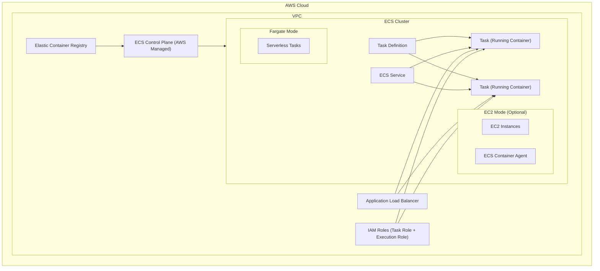

# Amazon ECS
> Amazon ECS has four core components:\
> Cluster: A logical grouping of services and tasks\
> Service: A group of identical tasks\
> Task: One or more containers performing a specific application function\
> Task Definition: Describes the task requirements (CPU, Memory, container images, networking type, IAM, etc.)


## 1. Mermaid Diagram – All ECS Components


---

## 2. Deep Dive – ECS Components Explained

### **1. ECS Cluster**
A logical grouping of tasks or container runtime environments (EC2 or Fargate). It represents the boundary where ECS runs workloads.

### **2. Task Definition**
- JSON blueprint for containers.
- Defines CPU, memory, ports, environment variables, IAM roles, volumes.
- Similar to a *PodSpec* in Kubernetes.

### **3. Task**
A running instance of a task definition. Equivalent to a *Pod* in Kubernetes.

### **4. ECS Service**
Maintains the desired count of tasks, handles deployment, rolling updates, and integrates with ALB/NLB.

### **5. ECS Control Plane**
Fully managed by AWS. Responsible for:
- Scheduling
- Task placement
- Health monitoring
- Scaling logic

### **6. Container Agent (EC2 Mode Only)**
Runs on EC2 instances to communicate task lifecycle events to ECS backend.

### **7. AWS Fargate**
A serverless compute engine that eliminates need to manage EC2.

### **8. ALB/NLB**
Used for routing external or internal traffic to containers.

### **9. IAM Roles (Task Role + Task Execution Role)**
- **Task Role** → permissions for the app
- **Execution Role** → permissions for pulling images + writing logs

---

## 3. ECS Interview Q & A (Most Asked)

### **Q1. What is the difference between ECS and EKS?**
**Answer:** ECS is AWS-native; EKS is Kubernetes. ECS is simpler; EKS is portable and complex.

### **Q2. What is a Task Definition?**
It is the JSON blueprint that defines how a task/container should run.

### **Q3. How does Service Auto Scaling work in ECS?**
Uses CloudWatch metrics to scale number of tasks automatically.

### **Q4. What is the difference between Task Role and Execution Role?**
Task Role → For your application
Execution Role → For ECS runtime actions (ECR pull, CloudWatch logs)

### **Q5. When should you choose ECS over EKS?**
If staying inside AWS ecosystem and want simplicity.

### **Q6. What is the difference between EC2 mode and Fargate mode?**
EC2 Mode → You manage servers
Fargate Mode → Serverless

### **Q7. What is Container Agent?**
An agent running on EC2 that communicates with the ECS backend.

---

## 4. ECS vs Kubernetes (K8s) Component Mapping

| ECS Component | Kubernetes Component | Equivalent Purpose |
|--------------|----------------------|---------------------|
| Cluster | Cluster | Logical boundary for workloads |
| Task Definition | PodSpec | Container blueprint |
| Task | Pod | Running container |
| Service | Deployment + Service | Scaling, monitoring, networking |
| ECS Control Plane | Kubernetes Control Plane | Scheduling + orchestration |
| EC2 Mode | Node (Worker Node) | Compute resource pool |
| Fargate | Fargate (also usable by EKS) | Serverless containers |
| ALB/NLB | Ingress + Service | Traffic routing |
| IAM Roles | RBAC + Service Accounts | Identity + permissions |

---


### When to choose ECS?
- Want simple orchestration
- AWS-only workloads
- Don’t want Kubernetes overhead

### When to choose EKS?
- Need Kubernetes API/CRDs
- Multi-cloud or hybrid
- Advanced networking or service mesh

---

## 5. Hands-On Lab — ECS Fargate + ALB

### Step 1 — Push Docker Image to ECR
```bash
aws ecr create-repository --repository-name demo-app
aws ecr get-login-password | docker login --username AWS --password-stdin <ECR-URI>
docker build -t demo-app .
docker tag demo-app:latest <ECR-URI>:latest
docker push <ECR-URI>:latest
```

### Step 2 — Create ECS Cluster
AWS Console → ECS → Create Cluster → Fargate networking-only

### Step 3 — Create Task Definition
- Launch type: FARGATE
- CPU: 256
- Memory: 512MB
- Port: 80
- Logs: awslogs

### Step 4 — Create Service with ALB
- Desired count: 2
- ALB listens on port 80
- Target group health check: `/`
- SG rules:
  - ALB SG: allow 80 from internet
  - Task SG: allow 80 from ALB SG only

### Step 5 — Validate Tasks
```bash
aws ecs list-tasks --cluster demo
aws ecs describe-tasks --cluster demo --tasks <task-ARN>
```

### Step 6 — Access App
Open the ALB DNS name:
