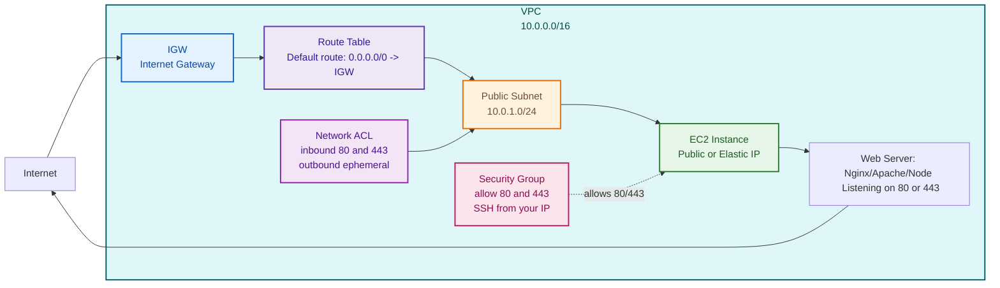
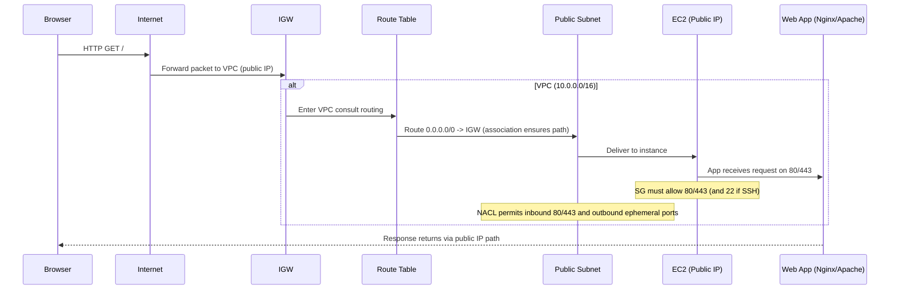

# Configuring a Public VPC with an EC2 Instance for Internet Access

> Goal: Reach an **EC2 instance directly from your browser via the public internet** (e.g., serve Nginx on port 80).

---

## 1) Architecture Diagrams 
### A. Layered Components and Relationships 

### B. Request Path (Sequence)


---

## 2) Why Each Component Matters (the essential reasoning)

| Component | Why We Need It |
|----------|----------------|
| **VPC** | The isolated private network where EC2 lives. It provides IP addressing, routing domain, isolation, and allows segmentation of public and private subnets. All networking boundaries start here. |
| **Public Subnet** | A subnet is *public* only if its route table has `0.0.0.0/0 -> IGW`. This gives EC2 instances inside it the ability to send outbound traffic to the internet and receive responses. |
| **Internet Gateway (IGW)** | Allows two way communication between VPC and the public internet. It supports NAT for public IPs and makes the VPC reachable from outside networks. Without IGW, public IPs cannot be used.|
| **Route Table** |Holds routing rules for traffic leaving the subnet. The public subnet must have a default route that targets the IGW. This ensures any non VPC traffic goes to the internet.|
| **Public IP / Elastic IP** | Public IPs allow the EC2 to be uniquely reachable from the global internet. Elastic IPs are static and persistent, ensuring stable DNS and browser access even across reboots. |
| **Security Group (SG)** |Stateful virtual firewall at the instance level. Must allow inbound HTTP 80 and HTTPS 443 for web apps, and usually SSH 22 from your IP for administration. Outbound is open by default to allow return traffic.|
| **Network ACL (NACL)** | Stateless subnet level firewall. Must permit inbound 80 and 443, and outbound ephemeral ports for return traffic. Helps enforce an additional security layer beyond SG. |
| **Web Server / App** | Something listening on `80/443` (e.g., Nginx/Apache/Node) to respond to browser requests. Without Nginx, Apache, Node, or a similar service listening on the port, the EC2 cannot respond to HTTP requests.|
| **EC2 OS Firewall (Optional but important)** | OS level firewall like iptables or ufw must not block ports 80 or 443. Even if SG and NACL allow traffic, the OS firewall can silently drop packets.|
| **DNS (Optional)** | To access EC2 via a friendly domain name instead of IP. If using Elastic IP, you can map a DNS A record to the EIP for stable URLs.|
| **Key Pair (For SSH)** | Needed only for administrative access to the EC2. It doesn't affect browser access but is required for remote login to configure or troubleshoot the server. |
| **VPC CIDR Planning** |Proper subnet sizing ensures enough usable IPs for scaling and avoids overlapping CIDRs that can break routing with VPN or Direct Connect in future. |


---

## 3) Step-by-Step Setup (Console)

1. **VPC**: `10.0.0.0/16`  
2. **Public Subnet**: `10.0.1.0/24` (associate with the public route table)  
3. **IGW**: Create and attach to VPC  
4. **Route Table**: Add `0.0.0.0/0 -> IGW` and associate to the subnet  
5. **EC2**: Launch in public subnet, **enable Public IP** (or Elastic IP)  
6. **SG**: Allow inbound `80/443`; SSH `22` from **your IP**  
7. **App**: Install Nginx/Apache and start the service  

---

## 4) Testing & Troubleshooting
- `curl -I http://<PUBLIC-IP>`
- Verify SG, NACL, route table association, and that the app is listening on `0.0.0.0:80`.

---

## 5) Optional: Minimal Terraform
```hcl
# VPC
resource "aws_vpc" "main" {
  cidr_block = "10.0.0.0/16"
  tags = { Name = "my-public-vpc" }
}

# Public subnet
resource "aws_subnet" "public" {
  vpc_id                  = aws_vpc.main.id
  cidr_block              = "10.0.1.0/24"
  map_public_ip_on_launch = true
  tags = { Name = "public-subnet-1" }
}

# Internet Gateway
resource "aws_internet_gateway" "igw" {
  vpc_id = aws_vpc.main.id
  tags = { Name = "my-vpc-igw" }
}

# Route table + default route
resource "aws_route_table" "public" {
  vpc_id = aws_vpc.main.id
  tags = { Name = "public-rt" }
}

resource "aws_route" "default" {
  route_table_id         = aws_route_table.public.id
  destination_cidr_block = "0.0.0.0/0"
  gateway_id             = aws_internet_gateway.igw.id
}

resource "aws_route_table_association" "public_assoc" {
  subnet_id      = aws_subnet.public.id
  route_table_id = aws_route_table.public.id
}

# Security Group for web
resource "aws_security_group" "web_sg" {
  name   = "web-sg"
  vpc_id = aws_vpc.main.id

  ingress {
    from_port   = 80
    to_port     = 80
    protocol    = "tcp"
    cidr_blocks = ["0.0.0.0/0"]
  }

  ingress {
    from_port   = 443
    to_port     = 443
    protocol    = "tcp"
    cidr_blocks = ["0.0.0.0/0"]
  }

  ingress {
    from_port   = 22
    to_port     = 22
    protocol    = "tcp"
    cidr_blocks = ["<YOUR_IP/32>"]
  }

  egress {
    from_port   = 0
    to_port     = 0
    protocol    = "-1"
    cidr_blocks = ["0.0.0.0/0"]
  }
}

# EC2 instance
resource "aws_instance" "web" {
  ami                           = "ami-xxxxxxxx"   # choose a valid AMI in your region
  instance_type                 = "t2.micro"
  subnet_id                     = aws_subnet.public.id
  vpc_security_group_ids        = [aws_security_group.web_sg.id]
  associate_public_ip_address   = true
  key_name                      = "my-key"         # optional for SSH
  tags = { Name = "public-web" }
}
```

---

### Final Checklist
- [ ] VPC + public subnet
- [ ] IGW attached
- [ ] Route table with `0.0.0.0/0 -> IGW` and association to subnet
- [ ] EC2 has public/Elastic IP
- [ ] SG allows `80/443` (SSH `22` from your IP)
- [ ] NACL permits inbound `80/443` & outbound ephemeral
- [ ] Web server is running

If all are true → **Browser → EC2 works**.
