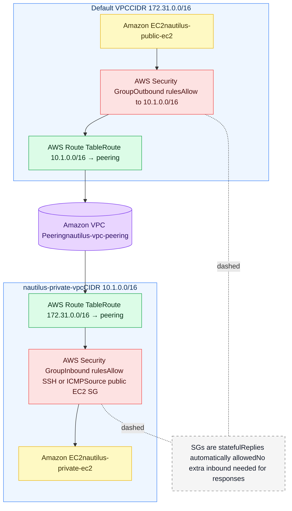
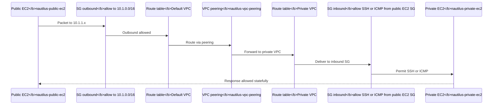

---

## 🔐 Security Group Rule Evaluation — How AWS Applies Rules
AWS Security Groups follow a very specific behavior model. Understanding this is crucial for VPC Peering.

### 🔸 1. **No Rule Order**
Security Groups do **not** process rules in order. There is:
- no priority
- no first-match logic
- no last-match logic

AWS simply checks:
> “Does **any** rule allow this traffic?”
If yes → allow. If no → deny.

### 🔸 2. **Allow‑Only Firewall Model**
Security Groups contain **only allow rules**. There are **no deny rules**. Anything not explicitly allowed is denied.

### 🔸 3. **Stateful Behavior**
If outbound is allowed for a connection, the **return traffic is automatically allowed**, even if inbound rules do not explicitly allow it.

### 🔸 4. **Multiple SGs Merge Together**
If an EC2 has several SGs attached, AWS merges all rules into one giant permissions set.

### ✅ Summary
- SGs are **stateful**
- SGs are **allow-only**
- Rule **order does not matter**
- If **any** rule matches → traffic allowed
- If **no** rule matches → traffic denied

This behavior ensures that your VPC Peering setup works as long as each side has **at least one** inbound/outbound rule permitting the traffic.

# Visual Security Group (SG) Flow — VPC Peering Path

This diagram shows **how packets traverse** from the public EC2 to the private EC2 through **VPC Peering**, and **where SGs** and **route tables** apply. It also highlights the **stateful** nature of SGs.

## 🗺️ Flowchart (Mermaid)

## 🔄 Sequence View (Mermaid)

---

### Key Takeaways
- **SGs are instance firewalls**: outbound on sender and inbound on receiver must allow the traffic.
- **Route tables provide the path**: each VPC must know the other’s CIDR via the peering connection.
- **Stateful SGs**: return traffic is automatically allowed once the initial outbound is permitted.

# Visual Security Group (SG) Flow — VPC Peering Path

This diagram shows **how packets traverse** from the public EC2 to the private EC2 through **VPC Peering**, and **where SGs** and **route tables** apply. It also highlights the **stateful** nature of SGs.

## 🗺️ Flowchart (Mermaid)

## 🔄 Sequence View (Mermaid)

---

### Key Takeaways
- **SGs are instance firewalls**: outbound on sender and inbound on receiver must allow the traffic.
- **Route tables provide the path**: each VPC must know the other’s CIDR via the peering connection.
- **Stateful SGs**: return traffic is automatically allowed once the initial outbound is permitted.

# Troubleshooting SG Issues in VPC Peering

Use this checklist when connectivity from `nautilus-public-ec2` to `nautilus-private-ec2` fails.

## ✅ Quick Checks
- **Peering status** is `Active` and both VPCs are in the **same region**.
- **CIDRs do not overlap** (Default VPC `172.31.0.0/16`, Private VPC `10.1.0.0/16`).
- **Correct route tables** are associated with the **right subnets**.
- **Private IP** is used for tests (peering does not carry public IP traffic).

## 🧱 Security Group Pitfalls
1) **Outbound blocked on public EC2**
   - Fix: allow outbound to `10.1.0.0/16` or keep default `allow all outbound`.

2) **Inbound blocked on private EC2**
   - Fix: allow **SSH (22)** or **ICMP** **from public EC2’s SG**.

3) **Wrong source in inbound rule**
   - Fix: reference **SG** (`sg-<public-ec2-sg-id>`) instead of public IP.

4) **Multiple SGs but missing the right one**
   - Fix: attach the SG that has the needed rules; SG rules merge but must exist.

## 🧭 Routing Pitfalls
1) **Missing route on either side**
   - Default VPC: `10.1.0.0/16 → pcx: nautilus-vpc-peering`
   - Private VPC: `172.31.0.0/16 → pcx: nautilus-vpc-peering`

2) **Wrong route table association**
   - Ensure `nautilus-private-subnet` uses the route table that contains the peering route.

3) **Overlapping CIDRs**
   - Peering cannot be established when CIDRs overlap.

## 🧪 Testing Pitfalls
1) **Testing with public IP**
   - Use `10.1.1.x`, not the public IP.

2) **OS firewall blocking** (iptables, firewalld, ufw)
   - Allow SSH and ICMP on the instance OS.

3) **DNS issues**
   - Test using IP first; resolve hostnames via `/etc/hosts` or Route 53 after connectivity works.

## 🧰 Additional Checks
- **NACLs**: confirm they are not denying ephemeral ports; NACLs are **stateless** with **ordered allow/deny**.
- **IAM or SSM**: if using Session Manager instead of SSH, verify SSM agent and IAM policies.
- **Key pairs**: ensure the right SSH key and user (`ec2-user` for Amazon Linux).

## 🧑‍⚕️ Minimal Fix Plan
1) Confirm peering **Active**
2) Add **both** routes
3) Public EC2 SG: outbound **allow** to `10.1.0.0/16`
4) Private EC2 SG: inbound **SSH or ICMP** from **public EC2 SG**
5) Test with `ping` and `ssh` using **private IP**

# NACL vs Security Group (SG) — Side‑by‑Side Comparison

| Aspect | Security Group (SG) | Network ACL (NACL) |
|---|---|---|
| **Layer** | Instance level (ENI) | Subnet level |
| **Association** | Attach to **ENI/EC2**, ALB, RDS etc | Attach to **subnet** |
| **Statefulness** | **Stateful** (responses auto‑allowed) | **Stateless** (responses must be explicitly allowed) |
| **Rule Types** | **Allow only** | **Allow and Deny** |
| **Order / Priority** | **No order**; any matching rule allows | **Ordered** by rule number; first match wins |
| **Defaults** | Inbound: deny all</b>Outbound: allow all | Inbound and Outbound both have default rules; evaluate order |
| **Logging** | Use **VPC Flow Logs** to observe | Use **VPC Flow Logs**; NACL itself has no dedicated logs |
| **Granularity** | Per‑instance behavior | Per‑subnet behavior |
| **Typical Use** | Control access to instances (e.g., SSH, app ports) | Additional subnet guardrails, blocklists, or compliance controls |
| **Peering Relevance** | Required to allow traffic at endpoints | Ensure not blocking ephemeral return ports across subnets |
| **Common Gotchas** | Forget outbound or inbound rules; wrong SG source | Forget return path rules; deny rules shadow allows; wrong order |

## Notes
- SGs and NACLs **work together**: SGs control instance access; NACLs can permit or deny at subnet edges.
- For VPC peering demos, most issues are SG or **missing routes**; NACLs matter if custom deny/allow lists are in place.
