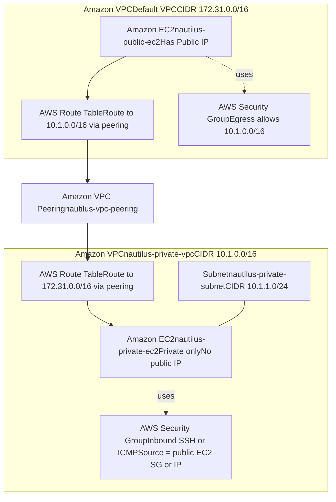

# VPC Peering Demo: Default Public VPC ↔ Private VPC

## 📣 Problem Statement
The Nautilus DevOps team must demonstrate **VPC Peering** to enable communication between two VPCs:
- A **Default public VPC** hosting a publicly accessible EC2 instance: `nautilus-public-ec2`
- A **Private VPC** (`nautilus-private-vpc`, CIDR `10.1.0.0/16`) with a private subnet (`nautilus-private-subnet`, CIDR `10.1.1.0/24`) hosting `nautilus-private-ec2`

**Goal:** Ensure the private EC2 instance is accessible from the public EC2 instance **over private IP** through a **VPC Peering** connection named `nautilus-vpc-peering`.

---

## 🔝 High-Level Solution Summary (What & Where)

**What is needed**
- **VPC Peering** between the Default VPC and `nautilus-private-vpc`
- **Route table entries** on **both** VPCs to the **other VPC’s CIDR** via the peering
- **Security group rules** to allow the required protocols (SSH/ICMP) from the public EC2 side to the private EC2

**Where it is needed**
- **Default VPC**
  - Route table: add `10.1.0.0/16 → pcx: nautilus-vpc-peering`
  - Public EC2 SG: allow egress to `10.1.0.0/16` (or specific private EC2 IP)
- **nautilus-private-vpc**
  - Route table (associated with `nautilus-private-subnet`): add `172.31.0.0/16 → pcx: nautilus-vpc-peering`
  - Private EC2 SG: allow inbound **SSH (22)** or **ICMP** from the **public EC2’s SG** or **private IP**

**Why it works**
- Peering enables **private IP routing** between VPCs (no NAT, no IGW, no transitive routing)
- Both sides must have **routes** to each other’s **CIDR** via the peering connection
- **Security groups** gate the traffic and must explicitly permit the protocol and source

---
## 🔍 Deep Explanation: What Is Happening in Routes & Security Groups

### 🟦 1. Default VPC (Public EC2 Side)

#### A) Route Table — Add `10.1.0.0/16 → pcx: nautilus-vpc-peering`
This tells AWS:
> “Traffic destined for **10.1.x.x** should be forwarded via the VPC Peering link.”

Why?
- Without this entry, the public EC2 has **no path** to the private VPC.
- Traffic would be dropped at the routing layer.

Where it applies:
- The **Default VPC’s main route table**.

#### B) Security Group — Allow outbound to `10.1.0.0/16`
Security Groups control **instance-level** traffic.

Why?
- Even if the route table allows routing, **SGs can block traffic before it even leaves the instance**.

Where it applies:
- The **SG attached to `nautilus-public-ec2`**.

---

### 🟩 2. nautilus-private-vpc (Private EC2 Side)

#### A) Route Table — Add `172.31.0.0/16 → pcx: nautilus-vpc-peering`
This creates the **return path**.

Why?
- Routing works only if **both VPCs** know how to reach each other.
- Missing this route results in **one-way connectivity**.

Where it applies:
- The route table associated with `nautilus-private-subnet`.

#### B) Security Group — Allow inbound SSH/ICMP from Public EC2
The private EC2 needs an inbound SG rule allowing:
- SSH (22)
- ICMP (ping)
- Source must be: public EC2’s private IP **or** public EC2's SG.

Why?
- SGs **gate the final acceptance** of packets.
- Even if routing is correct, the SG would otherwise drop traffic.

Where it applies:
- **SG attached to `nautilus-private-ec2`**.

---

## 📐 Architecture (Mermaid)


---

## 🧭 Prereqs
- Public EC2: `nautilus-public-ec2` (Default VPC)
- Private VPC: `nautilus-private-vpc` (10.1.0.0/16)
- Private Subnet: `nautilus-private-subnet` (10.1.1.0/24)
- Private EC2: `nautilus-private-ec2`

---

## 🧪 Verification Commands
```bash
ssh ec2-user@<public-ec2-public-ip>
ping -c 3 10.1.1.X
ssh ec2-user@10.1.1.X
```

---
