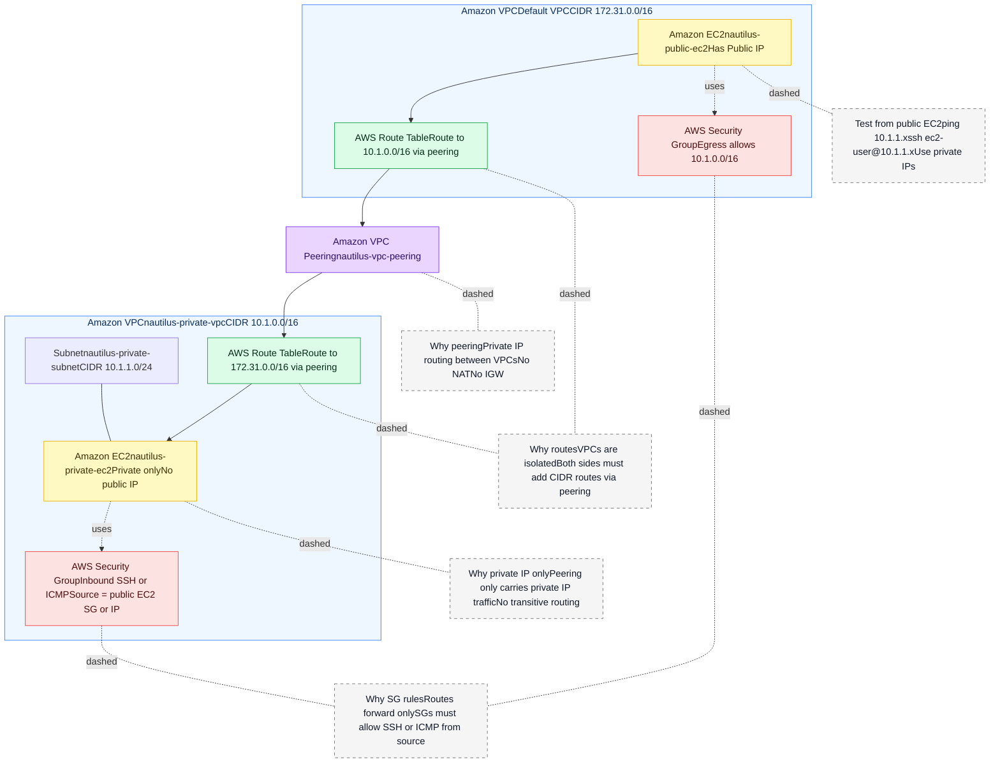

# VPC Peering Demo: Default Public VPC ↔ Private VPC

## 📣 Problem Statement
The Nautilus DevOps team must demonstrate **VPC Peering** to enable communication between two VPCs:
- A **Default public VPC** hosting a publicly accessible EC2 instance: `nautilus-public-ec2`
- A **Private VPC** (`nautilus-private-vpc`, CIDR `10.1.0.0/16`) with a private subnet (`nautilus-private-subnet`, CIDR `10.1.1.0/24`) hosting `nautilus-private-ec2`

**Goal:** Ensure the private EC2 instance is accessible from the public EC2 instance **over private IP** through a **VPC Peering** connection named `nautilus-vpc-peering`.

---

## 🔝 High-Level Solution Summary (What & Where)

**What is needed**
- **VPC Peering** between the Default VPC and `nautilus-private-vpc`
- **Route table entries** on **both** VPCs to the **other VPC’s CIDR** via the peering
- **Security group rules** to allow the required protocols (SSH/ICMP) from the public EC2 side to the private EC2

**Where it is needed**
- **Default VPC**
  - Route table: add `10.1.0.0/16 → pcx: nautilus-vpc-peering`
  - Public EC2 SG: allow egress to `10.1.0.0/16` (or specific private EC2 IP)
- **nautilus-private-vpc**
  - Route table (associated with `nautilus-private-subnet`): add `172.31.0.0/16 → pcx: nautilus-vpc-peering`
  - Private EC2 SG: allow inbound **SSH (22)** or **ICMP** from the **public EC2’s SG** or **private IP**

**Why it works**
- Peering enables **private IP routing** between VPCs (no NAT, no IGW, no transitive routing)
- Both sides must have **routes** to each other’s **CIDR** via the peering connection
- **Security groups** gate the traffic and must explicitly permit the protocol and source

---

## 📐 Architecture (Mermaid)



---

## 🧭 Prereqs (Already Provided)
- Public EC2 in Default VPC: `nautilus-public-ec2`
- Private VPC: `nautilus-private-vpc` CIDR `10.1.0.0/16`
- Private Subnet: `nautilus-private-subnet` CIDR `10.1.1.0/24`
- Private EC2 in `nautilus-private-subnet`: `nautilus-private-ec2`

> Note: Default VPC CIDR is typically `172.31.0.0/16`.

---

## ✅ Task List
1) **Create VPC Peering** between Default VPC and `nautilus-private-vpc`
   - Name: `nautilus-vpc-peering`
2) **Update Route Tables**
   - Default VPC route table: add `10.1.0.0/16 → pcx: nautilus-vpc-peering`
   - Private VPC route table: add `172.31.0.0/16 → pcx: nautilus-vpc-peering`
3) **Security Groups**
   - Public EC2 SG: allow **egress** to `10.1.0.0/16` (or specific host)
   - Private EC2 SG: allow **inbound** **SSH (22)** or **ICMP** from the **public EC2’s SG** or **private IP**
4) **Verify** from `nautilus-public-ec2` using **private IPs** of the target

---

## 🔧 How‑To (Console)
### 1) Create VPC Peering
- VPC → **Peering Connections** → **Create**
  - Requester: **Default VPC**
  - Accepter: **nautilus-private-vpc (10.1.0.0/16)**
  - Name tag: **nautilus-vpc-peering**
- **Create** → then **Accept** the request.

### 2) Update Route Tables
- Default VPC **main route table** → **Edit routes** → **Add route**
  - Destination: `10.1.0.0/16`
  - Target: **Peering connection** `nautilus-vpc-peering`
- Private VPC route table (associated with `nautilus-private-subnet`) → **Edit routes** → **Add route**
  - Destination: `172.31.0.0/16`
  - Target: **Peering connection** `nautilus-vpc-peering`

### 3) Security Groups
- Public EC2 SG → **Outbound**: allow to `10.1.0.0/16` (or the exact private IP)
- Private EC2 SG → **Inbound**:
  - SSH (22) from **public EC2’s SG** *or* **public EC2’s private IP**
  - ICMP (Echo Request) for ping tests if needed

---

## 🧪 Verification (from `nautilus-public-ec2`)
SSH into the **public EC2** using its **public IP**:

```bash
ssh ec2-user@<PUBLIC_EC2_PUBLIC_IP>
```

Find private EC2’s **private IP** (e.g., `10.1.1.x`) and test:

```bash
# ICMP test (if allowed)
ping -c 3 10.1.1.X

# SSH test (if allowed)
ssh ec2-user@10.1.1.X
```

> If SSH fails, check: key pair, SG inbound rule on private EC2, and that you’re using the **private IP** over peering.

---

## 🔒 Recommended SG Rule Examples
**Public EC2 SG (Outbound)**
```text
Type: All TCP (or SSH)
Destination: 10.1.0.0/16
Description: Allow traffic to private VPC via peering
```

**Private EC2 SG (Inbound) — Safer via SG reference**
```text
Type: SSH
Source: sg-<public-ec2-sg-id>
Description: Allow SSH from public EC2’s SG over peering

Type: ICMP - Echo Request
Source: sg-<public-ec2-sg-id>
Description: Allow ping for connectivity test
```

> Using **SG → SG** references is better than hardcoding IPs, especially if instances change.

---

## 🧠 Why This Works
- **VPC Peering** enables **private IP** routing between VPCs. No NAT, no Internet Gateway, and **no transitive routing**.
- **Route tables** on **both sides** must include routes to the **other VPC’s CIDR** via the peering connection.
- **Security groups** still gate the traffic — they must explicitly allow the protocol and source.
- Tests must use the **private IP** of the target EC2.

---

## 🚩 Common Pitfalls
- Missing route on **either** VPC route table.
- Using **public IP** in security group rules or tests — peering only carries **private IP** traffic.
- Private EC2 SG not allowing **SSH/ICMP** from the public EC2 side.
- Assuming peering is **transitive** (it isn’t). A third VPC won’t be reachable through this peering.

---

## 📎 Tags & Names (for consistency)
- Peering: `nautilus-vpc-peering`
- Public EC2: `nautilus-public-ec2`
- Private VPC: `nautilus-private-vpc` CIDR `10.1.0.0/16`
- Private Subnet: `nautilus-private-subnet` CIDR `10.1.1.0/24`
- Private EC2: `nautilus-private-ec2`

