# 🚀 If IGW Can Send Traffic Out, Why Do We Need a NAT Gateway?

This is one of the most common questions in AWS networking.
Even though IGW (Internet Gateway) connects a VPC to the Internet, **it does NOT give private instances outbound Internet access**.

Below explains **why**.

---

# 🌐 1. What an Internet Gateway (IGW) Actually Does

An IGW is *not* a NAT device.

It performs **one job only**:

### ✔ IGW allows communication **only for public IPv4 addresses**

Meaning:
- If an EC2 instance has a **public IP or Elastic IP**, IGW lets it talk to the Internet.
- If the instance has **only a private IP**, IGW will **drop the traffic**.

### ❌ IGW does NOT:
- translate private → public IP
- allow private subnets Internet access
- act as a firewall or proxy
- initiate connections

So while IGW is required for Internet connectivity, **it only works for public IPs**.

---

# 🔥 2. Why NAT Gateway Exists

NAT Gateway solves a different problem:

> **Allow private EC2 instances to access the Internet, WITHOUT exposing them to inbound traffic.**

### NAT Gateway provides:
- **NAT (Network Address Translation)**
- **Outbound-only Internet access**
- **No inbound connections allowed**
- **A public IP (Elastic IP)** through which private instances go out
- **Security** (keeps EC2 private)

Private instances can now:
- download OS updates
- pull Docker images
- reach external APIs
- connect to GitHub, NPM, PyPI, etc.

But they remain **invisible from the Internet**.

---

# ⚡ 3. IGW vs NAT Gateway Feature Comparison

| Feature | IGW | NAT Gateway |
|--------|-----|-------------|
| Does NAT for private IPs | ❌ No | ✔️ Yes |
| Outbound Internet for private subnets | ❌ No | ✔️ Yes |
| Inbound Internet allowed | ✔️ Yes if SG allows | ❌ No |
| Requires EC2 public IP | ✔️ Yes | ❌ No |
| Keeps instances private | ❌ No | ✔️ Yes |

### 🚫 IGW only allows traffic **from public IPs attached to EC2**
Private IPs like `10.0.1.25` cannot touch the Internet directly.
The Internet does not route **RFC1918** private addresses.

### ✔ NAT Gateway translates the private IP → its public Elastic IP (and forwards **via IGW**)

---

# 🔄 4. Mental Model

**IGW = A door to the Internet — only for instances with public IPs**

**NAT Gateway = A middleman — takes private IP traffic and sends it out using NAT Gateway’s public IP, then out via IGW to the Internet**

Public EC2 → IGW → Internet

Private EC2 → NAT GW → IGW → Internet

---

# 🗺 5.  Architecture Diagram 

---

# 🔁 6. Mermaid Sequence

```mermaid
sequenceDiagram
  participant A as EC2 (Private Subnet)
  participant N as NAT Gateway
  participant G as IGW
  participant I as Internet

  A->>N: Outbound packet from 10.0.1.10 to api.example.com
  N->>G: Translate 10.0.1.10 to Elastic IP and forward via IGW
  G->>I: Send to external service
  I->>G: Response to Elastic IP
  G->>N: Deliver response back to NAT
  N->>A: De-NAT to 10.0.1.10 — session complete
```

---

# 🧠 7. When Do You Need What?

| Use Case | Solution |
|----------|----------|
| EC2 must be reachable from Internet | Public IP + IGW |
| EC2 must NOT be reachable from Internet but needs outbound | NAT Gateway |
| EC2 talks only inside AWS (VPC, peering, S3 via VPC endpoint) | No IGW, no NAT needed |

---

# 📘 8. Summary

Even though IGW connects your VPC to the Internet, it does **not** perform NAT.
NAT Gateway is required when your EC2 instances are in private subnets and do not have public IPs.

**Without NAT Gateway:** Private instances cannot curl, update packages, or reach external APIs.

**With NAT Gateway:** Private EC2 can go out to the Internet safely.
